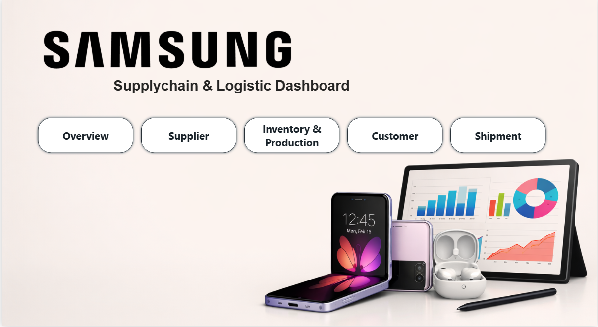
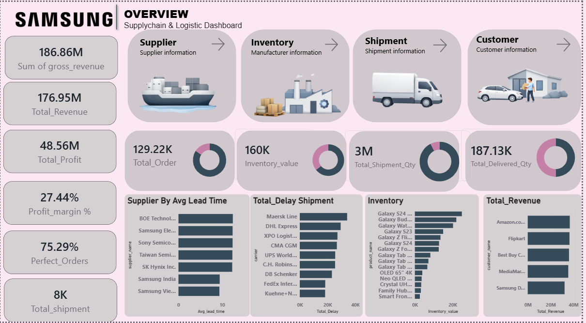
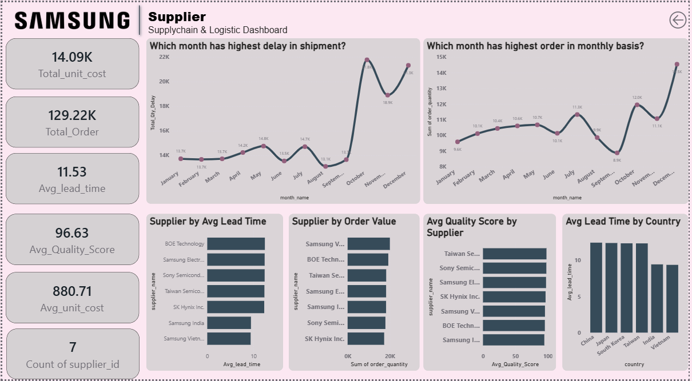
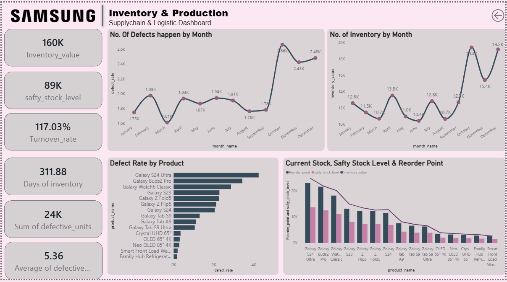
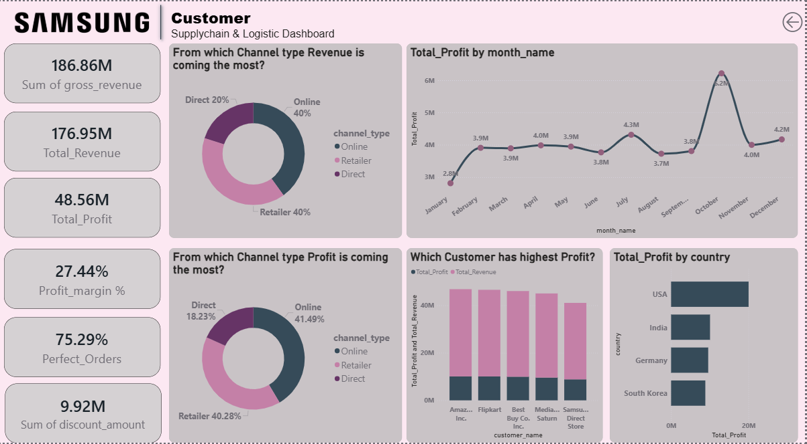
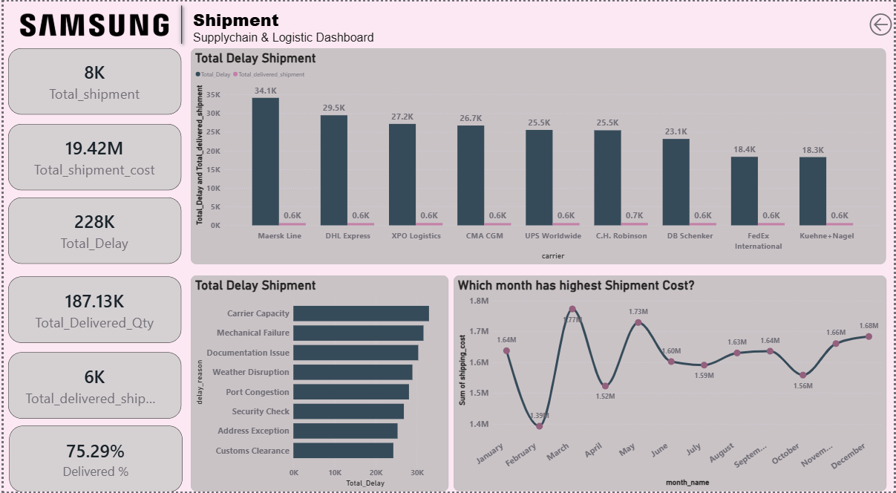

# Samsung Supply Chain & Logistic Dashboard (Power BI Project)

## Overview
This project presents a comprehensive Power BI dashboard analyzing Samsung’s supply chain and logistics performance. It integrates supplier, inventory, shipment, and customer data to provide actionable insights into operational efficiency, profitability, and delivery performance.

## Objectives

- Visualize end-to-end supply chain metrics

- Identify bottlenecks in supplier lead times and shipment delays

- Track inventory turnover, defect rates, and safety stock levels

- Analyze customer revenue and profit distribution across channels and countries

## Dashboard Sections

- **Overview**: Summarizes total revenue, profit, orders, shipments, and delivery performance

- **Supplier**: Displays supplier lead times, order values, and quality scores

- **Inventory & Production**: Highlights inventory value, defect rates, turnover, and 
reorder points

- **Customer**: Shows revenue and profit breakdown by channel, customer, and country

- **Shipment**: Analyzes shipment delays, costs, and carrier performance

## Key Insights

- Profit Margin: 27.44% with 75.29% perfect orders

- Top Supplier: BOE Technology (highest lead time)

- Highest Delay Month: October (21.8K delays)

- Top Product by Defects: Galaxy S24 Ultra

- Top Customer by Profit: Amazon Inc.

- Highest Shipment Cost Month: March (1.77M)

## Tools Used

- Power BI Desktop

- Data Modeling: Star schema (fact and dimension tables)

- Visualization Types: Bar charts, line graphs, pie charts, KPI cards, donut charts

## Dataset

Synthetic dataset designed for demonstration, including:

- Supplier details (lead time, quality score)

- Inventory and production metrics

- Shipment and delivery data

- Customer revenue and profit data

## Screenshots
Screenshot 1: Dashboard Home Page

Screenshot 2: Overview Dashboard

Screenshot 3: Supplier Dashboard

Screenshot 4: Inventory & Production Dashboard
 
Insert Screenshot 5: Customer Dashboard

Screenshot 6: Shipment Dashboard
 

## How to Use

1. Open Power BI Desktop

2. Load the `.pbix` file

3. Refresh data connections if needed

4. Navigate through tabs using the buttons on the home page

## Author

**Khushi**  
Data Analyst | Power BI Developer  
📍 Pune, India

"Certain materials, including logos and images, 
are included in this educational data analytics 
dashboard under the fair use provision of the Indian Copyright Act, 1957. 
These materials are used strictly for educational, non-commercial purposes. 
All copyrights and trademarks remain the property of their respective owners."

